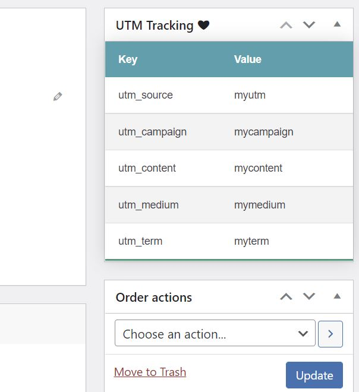

# WooCommerce UTM Tracking

This plugin allows for basic UTM Tracking and viewing in WooCommerce Orders.

Default UTM's tracked:
- utm_source
- utm_campaign
- utm_content
- utm_medium
- utm_term

These can be modified via the `get_tracking_meta_keys` filter.

## Set up

1. Copy into `/wp-content/plugins/`

2. Make sure WooCommerce is activated before activating this plugin.
